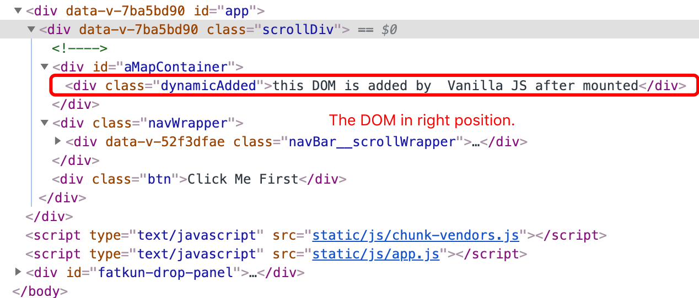

# Vue bug demo

## Follow the step to trigger bug

1. click "Click Me First" btn on the top left of screen.
2. Then  Click 'functional Component Click To Trigger BUG !'
3. Now we can see the DOM in **worng order**.

### This is what DOM tree should be


### This is DOM tree after bug showup


### Bug looks like this


## Build Setup

``` bash
# install dependencies
npm install
```

### Compiles and hot-reloads for development

```
npm run dev
```

### **Compiles and minifies for test server**

```
npm run build-dev
```

### Compiles and minifies for production

```
npm run build
```

### Run your analyze

```
npm run analyze
```
